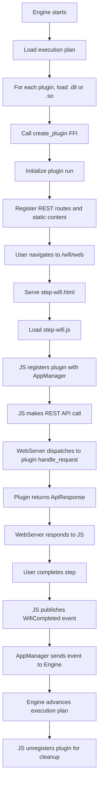

```mermaid
flowchart TD
    A[Engine starts] --> B[Load execution plan]
    B --> C[For each plugin, load .dll or .so]
    C --> D[Call create_plugin FFI]
    D --> E[Initialize plugin run]
    E --> F[Register REST routes and static content]

    F --> G[User navigates to /wifi/web]
    G --> H[Serve step-wifi.html]
    H --> I[Load step-wifi.js]
    I --> J[JS registers plugin with AppManager]

    J --> K[JS makes REST API call]
    K --> L[WebServer dispatches to plugin handle_request]
    L --> M[Plugin returns ApiResponse]
    M --> N[WebServer responds to JS]

    N --> O[User completes step]
    O --> P[JS publishes WifiCompleted event]
    P --> Q[AppManager sends event to Engine]
    Q --> R[Engine advances execution plan]

    R --> S[JS unregisters plugin for cleanup]
```