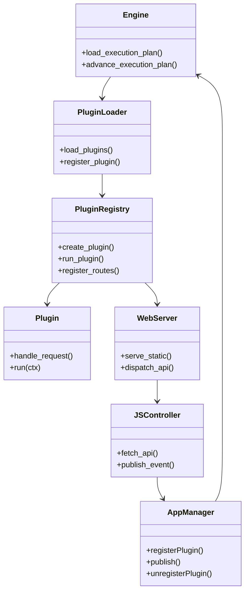

```mermaid
classDiagram
    class Engine {
        +load_execution_plan()
        +advance_execution_plan()
    }
    class PluginLoader {
        +load_plugins()
        +register_plugin()
    }
    class PluginRegistry {
        +create_plugin()
        +run_plugin()
        +register_routes()
    }
    class Plugin {
        +handle_request()
        +run(ctx)
    }
    class WebServer {
        +serve_static()
        +dispatch_api()
    }
    class AppManager {
        +registerPlugin()
        +publish()
        +unregisterPlugin()
    }
    class JSController {
        +fetch_api()
        +publish_event()
    }

    Engine --> PluginLoader
    PluginLoader --> PluginRegistry
    PluginRegistry --> Plugin
    PluginRegistry --> WebServer
    WebServer --> JSController
    JSController --> AppManager
    AppManager --> Engine
```