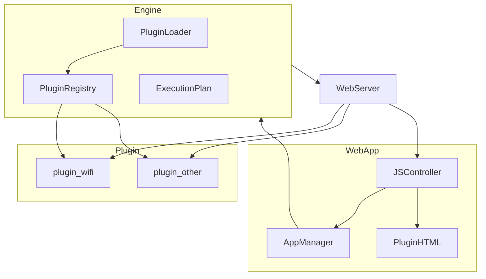

```mermaid
flowchart TD
    subgraph Engine
        PL[PluginLoader]
        PR[PluginRegistry]
        EP[ExecutionPlan]
    end

    subgraph Plugin
        P1[plugin_wifi]
        P2[plugin_other]
    end

    subgraph WebApp
        JS[JSController]
        AM[AppManager]
        HTML[PluginHTML]
    end

    WS[WebServer]

    Engine --> WS
    PL --> PR
    PR --> P1
    PR --> P2
    WS --> P1
    WS --> P2
    WS --> JS
    JS --> AM
    JS --> HTML
    AM --> Engine
```