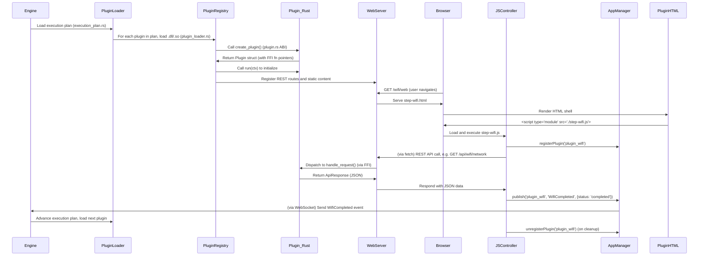

```mermaid
sequenceDiagram
    participant Engine
    participant PluginLoader
    participant PluginRegistry
    participant Plugin_Rust
    participant WebServer
    participant Browser
    participant JSController
    participant AppManager
    participant PluginHTML

    %% --- Engine Startup ---
    Engine->>PluginLoader: Load execution plan (execution_plan.rs)
    PluginLoader->>PluginRegistry: For each plugin in plan, load .dll/.so (plugin_loader.rs)
    PluginRegistry->>Plugin_Rust: Call create_plugin() (plugin.rs ABI)
    Plugin_Rust->>PluginRegistry: Return Plugin struct (with FFI fn pointers)
    PluginRegistry->>Plugin_Rust: Call run(ctx) to initialize
    PluginRegistry->>WebServer: Register REST routes and static content

    %% --- Web UI Routing ---
    Browser->>WebServer: GET /wifi/web (user navigates)
    WebServer->>Browser: Serve step-wifi.html
    Browser->>PluginHTML: Render HTML shell
    PluginHTML->>Browser: <script type="module" src="./step-wifi.js">
    Browser->>JSController: Load and execute step-wifi.js

    %% --- JS Activation and API Calls ---
    JSController->>AppManager: registerPlugin('plugin_wifi')
    JSController->>WebServer: (via fetch) REST API call, e.g. GET /api/wifi/network
    WebServer->>Plugin_Rust: Dispatch to handle_request() (via FFI)
    Plugin_Rust->>WebServer: Return ApiResponse (JSON)
    WebServer->>JSController: Respond with JSON data

    %% --- User Completes Step ---
    JSController->>AppManager: publish('plugin_wifi', 'WifiCompleted', {status: 'completed'})
    AppManager->>Engine: (via WebSocket) Send WifiCompleted event
    Engine->>PluginLoader: Advance execution plan, load next plugin

    %% --- Cleanup ---
    JSController->>AppManager: unregisterPlugin('plugin_wifi') (on cleanup)
```