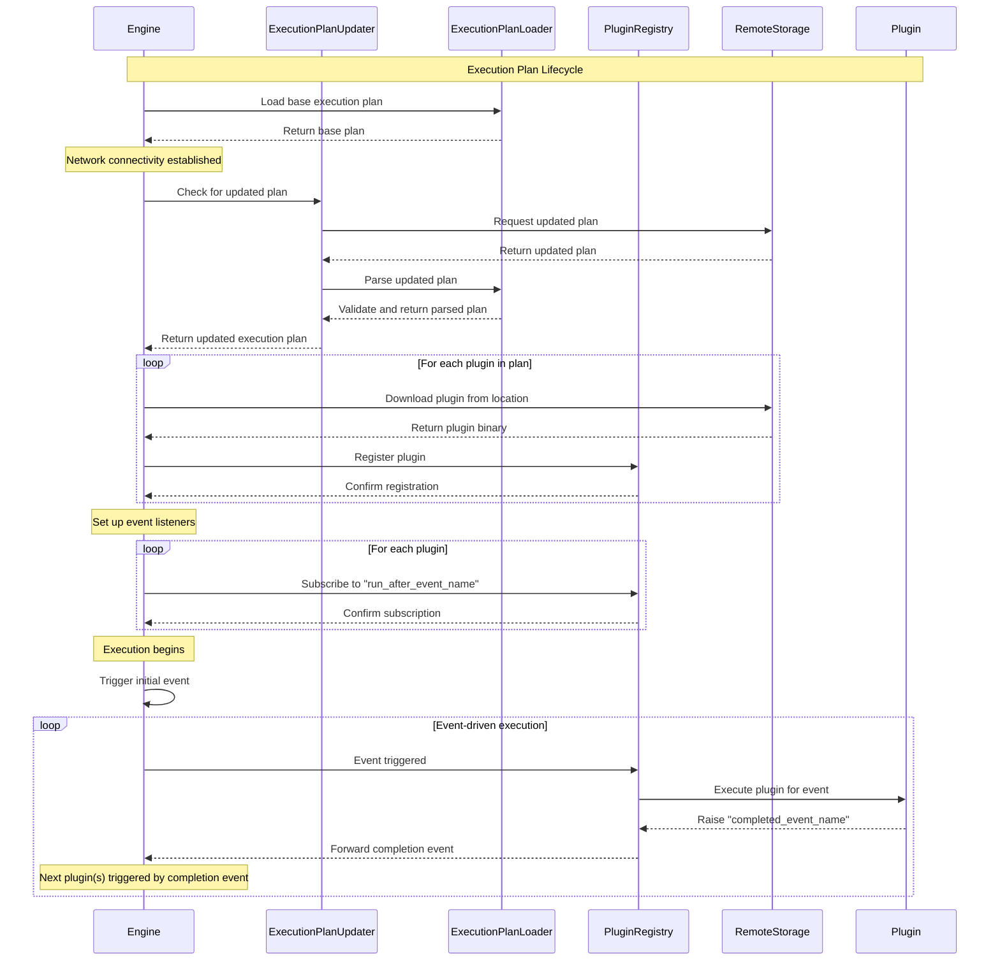

# Execution Plan

The execution plan system is a core component of the OOBE (Out-Of-Box Experience) engine that enables dynamic, event-driven plugin loading and execution. This document explains how the execution plan works, how it's updated, and how plugins are sequenced.

## Overview

The OOBE engine implements a flexible plugin architecture where:

1. Core plugins are loaded and executed in a predefined sequence on startup
2. Once the device connects to Wi-Fi, the engine checks for updated execution plans
3. The updated execution plan defines additional plugins to fetch and their execution sequence
4. Plugins are loaded dynamically at runtime and executed based on an event-driven system

## Execution Plan Structure

The execution plan (`execution_plan.toml`) is a TOML file with three main sections:

### 1. General Configuration

```toml
[general]
product_family = "Echo"
execution_plan_version = "1.3"
update_from = "s3"  # Options: "s3", "local", "unc"
update_path_root = "s3://my-bucket/execution_plans/"
```

- `product_family`: Identifies the product line (e.g., "Echo")
- `execution_plan_version`: Version of the execution plan
- `update_from`: Specifies the update source (s3, local, or unc)
- `update_path_root`: Base path for locating updated execution plans

### 2. Plugin Definitions

```toml
[[plugins]]
name = "plugin_example"
plugin_description = "Example plugin"
plugin_route = "example"
version = "3.4"
plugin_location_type = "s3"  # Options: "s3", "local"
plugin_base_path = "https://my-bucket.s3.amazonaws.com/plugins/plugin_example.dylib"
team_name = "Example Plugin Team"
engineering_contact_email = "example-eng@example.com"
operation_contact_email = "example-ops@example.com"
run_async = false
visible_in_ui = true
run_after_event_name = "TermsCompleted"  # Event that triggers this plugin
completed_event_name = "ExampleCompleted"  # Event raised when this plugin completes
```

Each plugin entry specifies:
- Basic metadata (name, description, version)
- Location information (type and path)
- Team contact details
- Execution parameters (async, UI visibility)
- Event-driven sequencing fields (run_after_event_name, completed_event_name)

### 3. Handoffs Configuration

```toml
[handoffs]
handoff_events = ["HowtoCompleted", "TutorialCompleted"]
```

This section defines special events that indicate when control should return to core plugins.

## Execution Plan Loading and Update Process

The execution plan update process works as follows:

1. The engine starts by loading the base execution plan included with the software
2. Once network connectivity is available, `ExecutionPlanUpdater` is triggered
3. The updater reads the base plan to determine the update source and path
4. Based on the `update_from` setting, it attempts to download an updated plan:
   - From an S3 bucket for `s3` source
   - From a local or network path for `local` or `unc` sources
5. If the updated plan is successfully downloaded, it replaces the current plan
6. If the download fails, the engine continues with the original plan

The path for the updated execution plan is constructed based on the product family and version:
```
{update_path_root}/{product_family}/{execution_plan_version}/execution_plan.toml
```

## Plugin Registry and Binding

The `PluginRegistry` is responsible for:
- Keeping track of all loaded plugins
- Providing access to plugins by name or route
- Supporting the plugin routing system for REST endpoints

Each plugin is wrapped in a `PluginBinding` that contains both the plugin implementation and its metadata.

## Event-Driven Plugin Sequencing

Plugins are executed in a sequence driven by events:

1. Each plugin specifies a `run_after_event_name` that indicates when it should be executed
2. When a plugin completes, it raises its `completed_event_name` event
3. The engine listens for these events and triggers the next plugins in the sequence
4. Special handoff events allow the engine to return control to core plugins

Example sequence:
```
LoginCompleted → plugin_settings → SettingsCompleted → plugin_howto → HowtoCompleted (handoff) → ...
```

## Benefits and Use Cases

This architecture provides several advantages:

1. **Dynamic Runtime Updates**: The setup experience can change without firmware updates
2. **A/B Testing**: Different execution plans can be served to different user segments
3. **Feature Flag Rollouts**: New features can be gradually introduced
4. **Regulatory Compliance**: Updates can be pushed to meet changing requirements
5. **Improved User Experience**: Devices in storage for extended periods can receive the latest OOBE immediately upon connecting

Even devices shipping with outdated firmware can receive an up-to-date setup experience as soon as they connect to the internet, ensuring a consistent and modern user experience across all devices.

## Implementation Details

The execution plan system is implemented through several key components:

- `ExecutionPlanLoader`: Parses and validates the TOML file
- `ExecutionPlanUpdater`: Handles checking for and downloading updated plans
- `PluginRegistry`: Manages all loaded plugins and their routing
- Event system: Coordinates the sequence of plugin execution

These components work together to provide a flexible, extensible system for managing the OOBE workflow.



