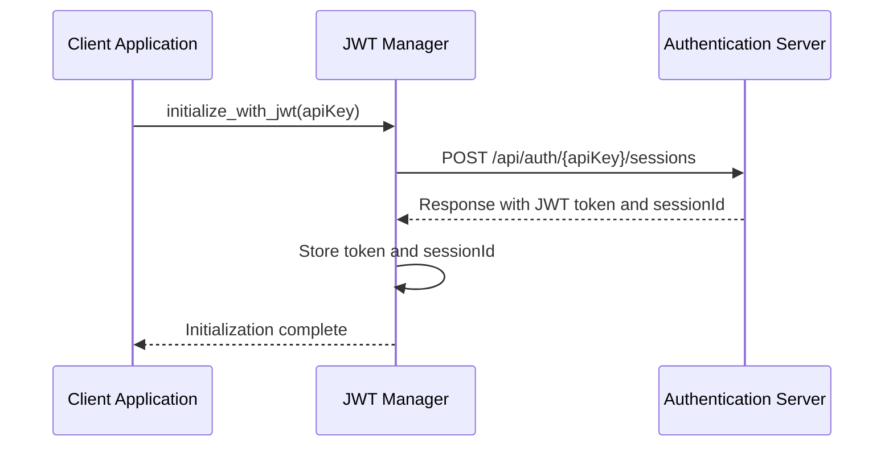
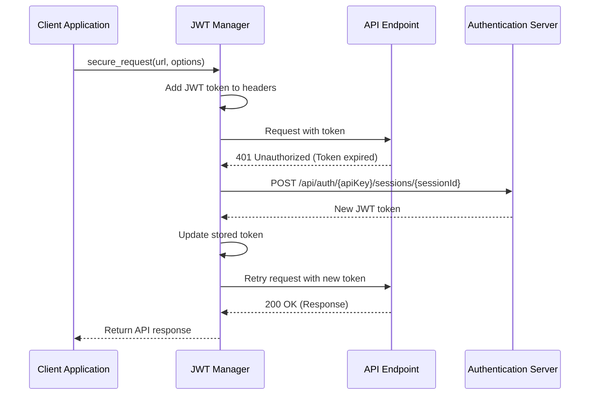
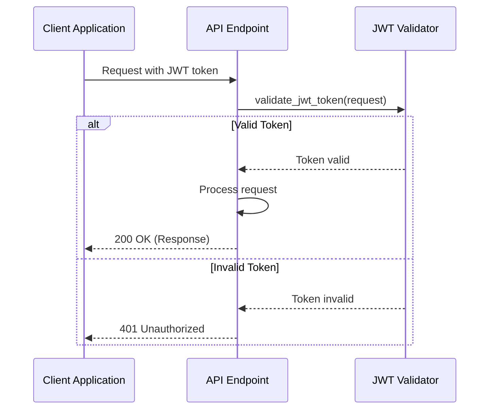
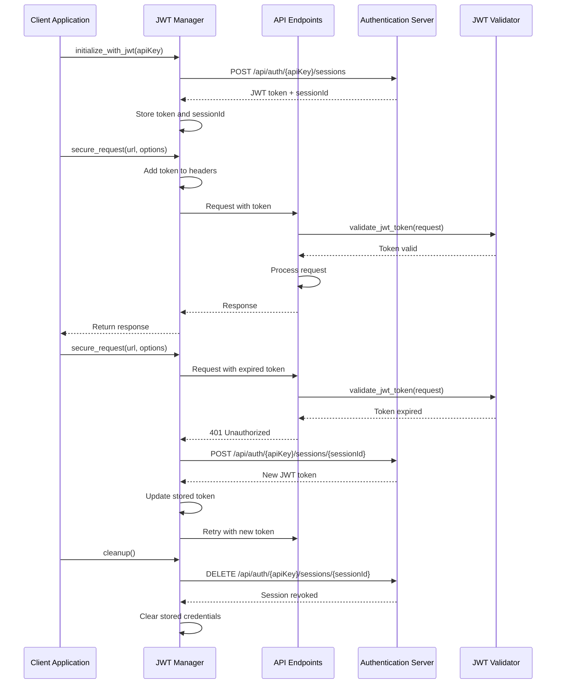

# JWT Authentication Workflow

This document explains how JWT (JSON Web Token) authentication works in the OOBE Workflow system, covering both client-side and server-side components.

## Client-Side JWT Management (webapp/jwt_manager.js)

The `jwt_manager.js` module handles authentication tokens on the client side with these key features:

1. **Initialization and Session Creation**:
   - The `initialize_with_jwt()` function establishes a new session with the server
   - It can use provided API credentials or generate random ones
   - Makes a request to `/api/auth/{apiKey}/sessions` to obtain a JWT token
   - Stores session ID and token in memory for subsequent requests

2. **Transparent Token Management**:
   - The `secure_request()` function wraps standard fetch requests with authentication
   - Automatically adds the JWT token to request headers (`Authorization: Bearer {token}`)
   - Handles token expiration with automatic refresh

3. **Token Refresh Mechanism**:
   - When a request receives a 401 Unauthorized response, the manager:
     - Attempts to refresh the token by calling `/api/auth/{apiKey}/sessions/{sessionId}`
     - Retries the original request with the new token if refresh is successful
     - This happens transparently to the application code using the manager

4. **Cleanup**:
   - When the application exits, the `cleanup()` function is called
   - Revokes the session on the server by sending a DELETE request
   - Clears all stored credentials and tokens

## Client Usage Example (plugin_wifi/web/step-wifi.js)

The WiFi plugin demonstrates how client code uses the JWT manager:

```javascript
// Example using secure_request to scan for WiFi networks
const response = await jwtManager.secure_request('/api/wifi/network');
```

Benefits of this approach:
- Application code doesn't need to handle tokens directly
- Authentication concerns are abstracted away
- Token refresh happens automatically if the original token expires
- Clean and simple API for authenticated requests

## Server-Side JWT Validation (plugin_core/jwt_utils.rs)

On the server side, the `jwt_utils` module provides JWT validation functionality:

1. **Centralized Validation**:
   - The `validate_jwt_token()` function extracts and validates JWT tokens from API requests
   - Used consistently across all plugin request handlers

2. **Validation Process**:
   - Extracts the `Authorization` header from the incoming request
   - Verifies it has the correct format (`Bearer {token}`)
   - Uses `libjwt` to validate the token's integrity and expiration
   - Returns a Result indicating success or failure with appropriate error messages

3. **Plugin Integration (plugin_wifi/src/lib.rs)**:
   - Each plugin's `handle_request` function calls `validate_jwt_token` before processing
   - If validation fails, an error response is returned immediately
   - If successful, the function continues with the actual request handling

```rust
// Example JWT validation in a plugin request handler
if let Err(response) = validate_jwt_token(request) {
    return response;
}
```

## Security Benefits

This JWT workflow provides several security advantages:

1. **Stateless Authentication**: The server doesn't need to store session data
2. **Token Expiration**: Tokens have limited lifetimes, reducing risk if intercepted
3. **Automatic Refresh**: Users maintain authentication without manual intervention
4. **Consistent Validation**: All API endpoints use the same validation logic
5. **Separation of Concerns**: Authentication is handled independently from business logic

The system creates a seamless authentication experience where:
- Clients obtain tokens during initialization
- Requests automatically include valid tokens
- Token refresh happens transparently when needed
- All server endpoints validate tokens consistently

## Sequence Diagrams

The following diagrams illustrate the JWT authentication flows in the system:

### Client-Side JWT Initialization Flow



### Token Refresh Sequence



### Server-Side JWT Validation Flow



### Complete Authentication Lifecycle


