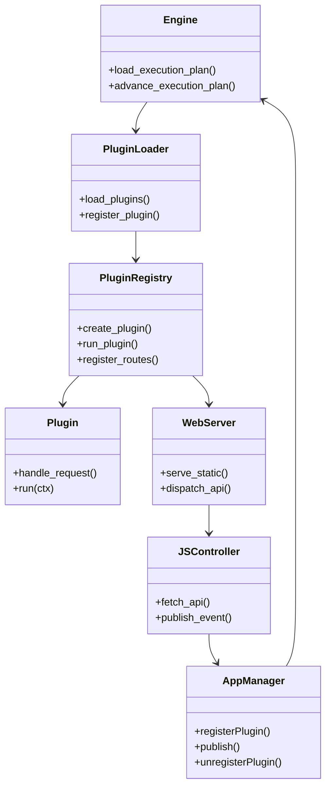
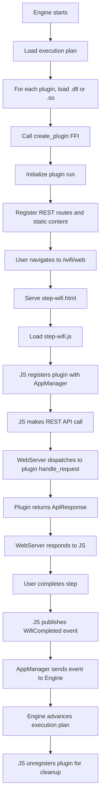
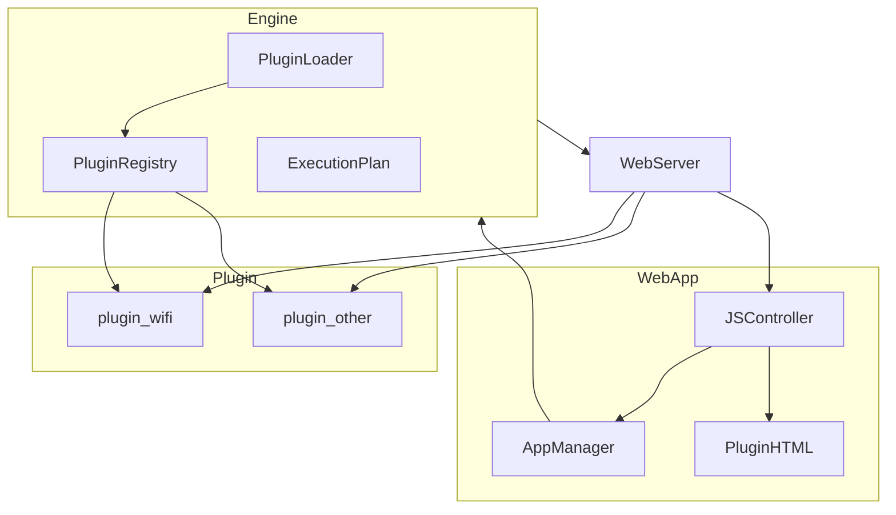
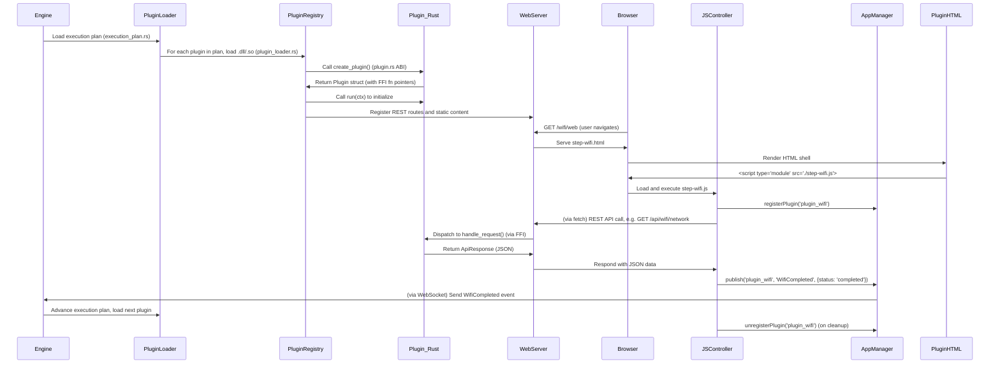

# OOBE SDK

The following sections will walk through the core components of our OOBE architecture, including the plugin interfaces, runtime behaviors, and how execution plans govern the user journey. We will explore how plugins are registered, invoked, and how they communicate with each other and with the UI layer. Together, these pieces form the foundation of a scalable, extensible, and future-proof OOBE platform.

## Plugin Model and Interface

Each plugin is built as a dynamic library implementing a fixed ABI surface defined by the engine. The core entry point is `create_plugin()`, which returns a pointer to a `Plugin` struct:

```rust
#[repr(C)]
pub struct Plugin {
    pub name: extern "C" fn() -> *const c_char,
    pub plugin_route: extern "C" fn() -> *const c_char,
    pub run: extern "C" fn(ctx: *const PluginContext),
    pub get_static_content_path: extern "C" fn() -> *const c_char,
    pub get_api_resources: extern "C" fn(out_len: *mut usize) -> *const Resource,
    pub handle_request: extern "C" fn(request: *const ApiRequest) -> *mut ApiResponse,
    pub cleanup: extern "C" fn(response: *mut ApiResponse),
    pub run_workflow: Option<extern "C" fn(input: *const ApiRequest) -> *mut ApiResponse>,
    pub on_progress: Option<extern "C" fn() -> *mut ApiResponse>,
    pub on_complete: Option<extern "C" fn() -> *mut ApiResponse>,
}
```

This ABI enables the engine to load plugins without relying on Rust-specific constructs like traits or vtables, preserving platform independence and safety across FFI boundaries. Each function in the interface serves a specific purpose:

- `name` and `plugin_route`: Provide identity and routing information
- `run`: Initializes the plugin with configuration parameters
- `get_static_content_path`: Returns the path to the plugin's web assets
- `get_api_resources`: Defines the REST API endpoints exposed by the plugin
- `handle_request`: Processes incoming API requests
- `cleanup`: Responsible for deallocating memory allocated by the plugin
- `run_workflow`, `on_progress`, `on_complete`: Optional callbacks for long-running tasks

Plugins implement this interface through the `plugin_core` crate, which provides macros that hide much of the FFI complexity from plugin developers.

## Engine Initialization and Plugin Lifecycle

At startup, the engine reads a static configuration for required plugins (e.g., WiFi, Terms, Status), followed by an optional dynamic execution plan fetched from disk or a remote location. For each plugin:

1. The engine uses `libloading::Library` to load the `.so`/`.dll`.
2. It calls `create_plugin()` and extracts metadata, including `plugin_route`, `name`, and static asset path.
3. It stores the loaded plugin in a registry mapped by both name and route.
4. It invokes the plugin’s `run()` method with a `PluginContext` containing configuration parameters.
5. It retains the library handle to prevent unloading during execution.

## Plugin Loading and Dynamic Routing (Rust and Web)

### Rust Side: Plugin Loading and Registration

On the Rust side, plugins are loaded from `.so`/`.dll` files using `libloading`. Each plugin must export the `create_plugin()` symbol, which returns a `Plugin` struct. Here's how a plugin is loaded and registered in `plugin_loader.rs`:

```rust
let lib = unsafe { Library::new(path)? };
let constructor: Symbol<unsafe extern "C" fn() -> *mut Plugin> = unsafe { lib.get(b"create_plugin")? };
let plugin_ptr = unsafe { constructor() };
let plugin = unsafe { *Box::from_raw(plugin_ptr) };

let route = ffi_cstr_to_string((plugin.plugin_route)());
let name = ffi_cstr_to_string((plugin.name)());

let binding = PluginBinding::new(name.clone(), route.clone(), plugin, path.clone());
registry.register(binding);
```

After registration, the engine can look up the plugin by route or name using:

```rust
registry.get_by_route("wifi")
```

The plugin's route is used for both serving web content and handling REST API calls.

---

### Web App: Dynamic Routing to Plugin Views

In the web UI, plugin navigation is handled by JavaScript using the `router.js` module. When a user navigates to a route like `/wifi/web`, the app dynamically loads that plugin's HTML and JavaScript controller.

From `router.js`:

```javascript
export async function routeTo(path) {
  const parts = path.split("/").filter(Boolean);
  const pluginName = parts[0];

  const htmlUrl = `/${pluginName}/web/step-${pluginName}.html`;
  const jsUrl = `/${pluginName}/web/step-${pluginName}.js`;

  const html = await fetch(htmlUrl).then(res => res.text());
  document.getElementById("content").innerHTML = html;

  const module = await import(jsUrl);
  if (typeof module.activate === "function") {
    await module.activate(document.getElementById("content"));
  }
}
```

This approach allows any plugin with a properly named HTML and JS file to be mounted dynamically. The JS file must export an `activate(container)` function to bind UI logic to REST APIs.

When the user navigates from one plugin to another, the router updates the history and dispatches a synthetic `popstate` event to re-route the shell:

```javascript
history.pushState({}, "", "/status/web");
window.dispatchEvent(new PopStateEvent("popstate"));
```

This dynamic web routing mechanism mirrors the plugin routing used in the engine, ensuring the correct assets and APIs are loaded without hardcoding plugin names or routes.

## Plugin Types: Headless vs. UI Plugins

The OOBE engine supports two primary types of plugins: **UI plugins** and **headless plugins**. While all plugins implement the same FFI interface and are registered in the same way, the distinction lies in whether they expose user-facing web views or operate silently in the background.

### UI Plugins

A UI plugin provides a frontend interface rendered in the browser and typically interacts with the user via forms, buttons, or status updates. These plugins serve their web content from a folder like `/web` and expose both HTML and JavaScript entry points.

For example, `plugin_status` is a UI plugin that monitors progress and reflects status updates in real-time using WebSocket communication. Its `step-status.html` contains a simple container:

```html
<div id="statusContent">Waiting for updates...</div>
<script type="module" src="./step-status.js"></script>
```

The corresponding `step-status.js` establishes a WebSocket connection and subscribes to status updates:

```javascript
let ws = new WebSocket('ws://localhost:8081/ws');

ws.onopen = () => {
    ws.send('register-name:plugin_status');
    ws.send('subscribe:StatusMessageChanged');
    console.log('Subscribed to StatusMessageChanged topic');
};

ws.onmessage = (event) => {
    try {
        const data = JSON.parse(event.data);
        if (data.topic === 'StatusMessageChanged') {
            const status = JSON.parse(data.payload);
            statusContent.textContent = status.status || 'Unknown status';
        }
    } catch (err) {
        console.error('Error processing message:', err);
        statusContent.textContent = 'Error processing status update';
    }
};
```

This WebSocket-based approach provides immediate status updates without polling, creating a responsive user experience as the task agent progresses through its workflow steps.

### Headless Plugins

A headless plugin does not provide any web UI. It operates in the background and is typically used to perform long-running tasks, coordinate work across other plugins, or emit telemetry.

A good example is `plugin_task_agent_headless`, which simulates a three-phase job ("initializing", "processing", "finalizing"). It exposes a REST endpoint to trigger the job and relies on `on_progress()` and `on_complete()` for polling updates.

Its `run_workflow()` method launches a background thread:

```rust
thread::spawn(|| {
    *PROGRESS_STATE.lock().unwrap() = "Step 1: initializing...".to_string();
    thread::sleep(Duration::from_secs(2));
    *PROGRESS_STATE.lock().unwrap() = "Step 2: processing...".to_string();
    thread::sleep(Duration::from_secs(2));
    *PROGRESS_STATE.lock().unwrap() = "Step 3: finalizing...".to_string();
    thread::sleep(Duration::from_secs(2));
    *PROGRESS_STATE.lock().unwrap() = "Job completed".to_string();
});
```

Meanwhile, `on_progress()` returns the current job phase as a JSON payload:

```rust
let current = PROGRESS_STATE.lock().unwrap().clone();
let msg = format!(r#"{{ "status": "{}" }}"#, current);
json_response(200, &msg)
```

And `on_complete()` lets the engine determine when to stop polling and proceed:

```rust
if current == "Job completed" {
    json_response(200, r#"{ "message": "Job finished" }"#)
} else {
    json_response(204, r#"{ "message": "Still running" }"#)
}
```

This headless plugin does not render anything in its HTML:

```html
<!-- headless plugin stub -->
<div class="plugin-section text-muted">
  <em>This plugin runs in the background and does not have a UI.</em>
</div>
```

And its JS controller is a no-op:

```javascript
export function activate(container) {
  console.log("[taskagent] No UI to activate. Headless plugin.");
}
```

### Example: Interaction Between Headless and UI Plugins

When the task agent plugin is run (either via REST or from a `run_workflow()`), it updates its shared internal progress. The `plugin_status` plugin continuously polls `GET /api/status/statusmessage`, which reflects the current state pulled from `plugin_task_agent_headless`.

This decoupling is intentional. The task agent does not need to know who is watching its output, and the status UI does not need to care who updates the shared state—as long as someone does. This allows one plugin to visualize the internal state of another in a clean and modular fashion, using only REST calls and shared memory primitives inside the engine.

## Inter-Plugin Communication via WebSocket

The OOBE system implements real-time communication between plugins, the engine, and web UI components using a WebSocket server. This enables status updates, progress monitoring, and event-driven workflow transitions.

### WebSocket Topics and Message Flow

The system uses predefined topics for different types of messages:
- `StatusMessageChanged`: For progress and status updates
- `NetworkConnected`: For network connection events that trigger workflows

### Engine: Subscribe and Listen

The engine subscribes to topics to monitor plugin events. From `engine/src/lib.rs`:

```rust
// Subscribe to both status and network topics
if let Some(client_arc) = ENGINE_WS_CLIENT.get() {
    let mut client = client_arc.lock().unwrap();
    
    for topic in [STATUS_CHANGED, NETWORK_CONNECTED] {
        client.subscribe("engine_subscriber", topic, "").await;
        println!("Engine, subscribed to {}", topic);

        client.on_message(topic, move |msg| {
            println!("[engine] => {}: {}", topic, msg);
        });
    }
}
```

### Background Plugin: Publishing Updates

The task agent plugin (`plugin_task_agent_headless/src/lib.rs`) publishes status updates during its workflow:

```rust
for step in steps {
    // Update progress state
    {
        let mut lock = PROGRESS_STATE.lock().unwrap();
        *lock = step.to_string();
    }

    // Publish status update
    if let Some(client_arc) = PLUGIN_WS_CLIENT.get() {
        let client_arc = client_arc.clone();
        let step = step.to_string();
        let timestamp = chrono::Utc::now().to_rfc3339();

        runtime.block_on(async {
            if let Ok(mut client) = client_arc.lock() {
                client.publish("plugin_task_agent", STATUS_CHANGED, &step, &timestamp).await;
            }
        });
    }

    thread::sleep(Duration::from_secs(2));
}
```

### Web UI: Subscribe and Display

The status plugin's web component (`plugin_status/web/step-status.js`) subscribes to status updates and reflects them in the UI:

```javascript
ws.onmessage = (event) => {
    try {
        const data = JSON.parse(event.data);
        if (data.topic === 'StatusMessageChanged') {
            const status = JSON.parse(data.payload);
            statusContent.textContent = status.status || 'Unknown status';
        }
    } catch (err) {
        console.error('Error processing message:', err);
        statusContent.textContent = 'Error processing status update';
    }
};
```

### Workflow Trigger via WebSocket

When the WiFi plugin connects successfully, it publishes a message that triggers the task agent's workflow (`plugin_wifi/web/step-wifi.js`):

```javascript
// After successful WiFi connection
if (ws && ws.readyState === WebSocket.OPEN) {
    const message = {
        publisher_name: "plugin_wifi",
        topic: "NetworkConnected",
        payload: JSON.stringify({ status: 'connected', ssid: ssid }),
        timestamp: getTimestamp()
    };
    ws.send(`publish-json:${JSON.stringify(message)}`);
}
```

The engine receives this message and triggers the task agent's workflow:

```rust
client.on_message(NETWORK_CONNECTED, move |msg| {
    if let Some(run_workflow_fn) = task_agent.run_workflow {
        let json_bytes = r#"{"task": "background_job"}"#.as_bytes().to_vec();
        let json_len = json_bytes.len();
        let body_ptr = Box::into_raw(json_bytes.into_boxed_slice()) as *const u8;
        
        let request = ApiRequest {
            method: HttpMethod::Post,
            path: CString::new("job").unwrap().into_raw(),
            headers: std::ptr::null(),
            header_count: 0,
            body_ptr,
            body_len: json_len,
            content_type: std::ptr::null(),
            query: std::ptr::null(),
        };

        let _ = run_workflow_fn(&request);
    }
});
```

This WebSocket-based communication enables:
- Real-time status updates without polling
- Event-driven workflow transitions
- Loose coupling between plugins
- Immediate UI feedback for background operations

## Execution Plan and Plugin Metadata

Plugins listed in the execution plan are described using `PluginMetadata`, which includes fields like:

```toml
[[plugins]]
name = "plugin_wifi"
plugin_route = "wifi"
version = "1.0.0"
plugin_location_type = "local"
plugin_base_path = "./plugins"
run_async = true
visible_in_ui = true
run_after_event_name = "WelcomeCompleted"
completed_event_name = "WifiCompleted"
```

Each plugin is loaded from `plugin_base_path` and initialized in the same way as static plugins. Conditional loading, version pinning, or remote fetching (e.g., via S3) can be implemented with no change to engine logic.

## Routing Architecture

The engine exposes two major routing layers using Axum:

### Static Web Content

Each plugin defines a static content path like `wifi/web` via `get_static_content_path()`. This path is mounted at:

```
/wifi/web/*
```

So the file `wifi/web/step-wifi.html` is accessible at `/wifi/web/step-wifi.html`.

### REST APIs

REST APIs are declared by the plugin in `get_api_resources()`. These return a slice of `Resource`, each describing a relative path and supported HTTP methods. The engine maps these under:

```
/api/<plugin_route>/<resource>
```

For example, `plugin_route = "wifi"` and `resource = "network"` results in:

- `GET /api/wifi/network` → scan
- `POST /api/wifi/network` → connect

## Web UI Shell and Frontend Composition

The frontend is a minimal HTML shell hosted from `/webapp/index.html`. It contains a header and a `<main id="content">` placeholder. At load time, `app.js` dispatches control to a router module which dynamically injects plugin UIs based on the current URL.

```js
routeTo("/wifi/web");

function routeTo(path) {
  const pluginName = path.split("/")[1];
  const htmlUrl = `/${pluginName}/web/step-${pluginName}.html`;
  const jsUrl = `/${pluginName}/web/step-${pluginName}.js`;

  // Fetch HTML and activate plugin
}
```

Each plugin must export an `activate(container)` function in its JS module. This function binds DOM events to the plugin's REST APIs and handles UI updates.

## Progress Polling and Task Chaining

For long-running or multi-step workflows, the engine supports progress callbacks via `on_progress()` and `on_complete()`.

- `on_progress()` returns a `ApiResponse` with structured status.
- `on_complete()` returns HTTP 200 on task success.

The engine polls these methods every second using `tokio::spawn`. If progress messages are returned, they are forwarded as `POST` requests to the `status` plugin via `handle_request()`. This allows one plugin to report updates to another without a shared memory bus.

When `on_complete()` indicates success, the engine can invoke `run_workflow()` on the next plugin, allowing chained execution.

## Logger System and HTTP Telemetry

The engine includes a flexible, modular logging system based on runtime configuration:

- The logger is initialized from a TOML config file (`app_config.toml`)
- It supports both file-based and HTTP-based destinations.
- Logger behavior is driven by the following config section:

```toml
[logging]
type = "http"
http_endpoint = "http://localhost:9000/logs"
threshold = "debug"
```

Logging follows the `Logger` trait and is implemented via `LogWriter`. Messages are serialized to `LogEntry` and dispatched to the configured destination.

If `type = "file"`, logs are written in JSON lines to a rotating log file. If `type = "http"`, logs are posted to the endpoint as structured JSON payloads.

The logger is accessed globally via:

```rust
// Initialize logger once
LoggerLoader::init("app_config.toml").await;

// Then use it 
let logger = LoggerLoader::get_logger();
logger.log(LogLevel::Info, "Logger initialized");
```

## Plugin Scaffolding with Scripts

To simplify plugin creation, the system provides `create_plugin.sh` (Unix/macOS) and `create_plugin.bat` (Windows). These scripts generate a new plugin scaffold from template files.

### Example Usage

#### On Linux/macOS

```bash
chmod +x create_plugin.sh
./create_plugin.sh plugin_wifi wifi network
```

#### On Windows

```cmd
create_plugin.bat plugin_wifi wifi network
```

### What This Creates

```
plugins/
└── plugin_wifi/
    ├── src/
    │   └── lib.rs
    ├── web/
    │   ├── step-wifi.html
    │   └── step-wifi.js
    ├── Cargo.toml
    └── README.md
```

- `plugin_wifi`: the crate name
- `wifi`: the plugin route
- `network`: the REST resource

### Template Substitution

- Rust files use `{{plugin_name}}`, `{{plugin_route}}`, `{{resource_name}}`
- HTML/JS files use the same to bind REST endpoints
- Cargo.toml and README are also customized

### Example REST

```http
GET  /api/wifi/network
POST /api/wifi/network
```

The generated plugin is immediately usable in either manual or execution-plan-based loading.

## Diagrams

### Plugin class diagram



### Plugin activity diagram



### Plugin component diagram



### Plugin lifecycle sequence diagram

